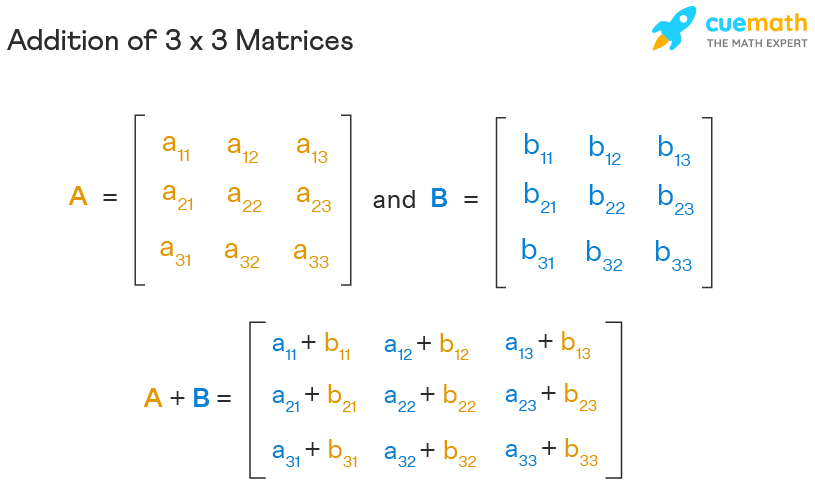
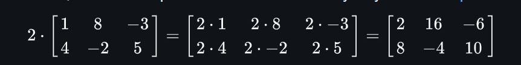
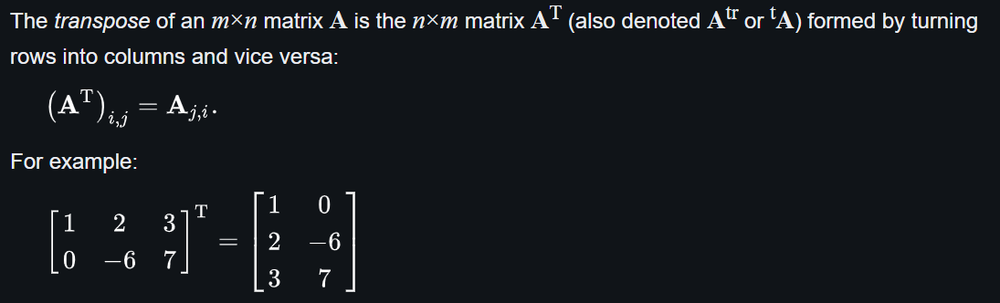

# ALGEBRA LINEARE 

### MATRICI
le matrici sono array contenenti numeri organizzati in row e colonne.  
Le dimensioni di una matrice viene data dalle row e colonne, una matrice con solo una row viene detta **row matrix**, invece una matrice con solo una colonna viene detta **column matrix** e una matrice con row e colonne uguali viene detta **square matrix**.  
Per selezionare un elemento dentro alla matrice si fa riferimento A[i,j] es A[1,3]

### ADDIZIONI CON MATRICI 
Per eseguire un addizioni con matrici le loro dimensioni devono essere uguali 

### MOLTIPLICAZIONE SCALARE
una moltiplicazione tra un valore c e la matrice A è calcolata moltiplicando tutti gli elementi con c 

### SOTTRAZIONE 
la sottrazione tra due matrici è come la addizione ma bisogna moltiplicare i valori di una matrice per -1

### MOLTIPLICAZIONE CON MATRICI
una moltiplicazione tra matrici si può avere solo se il numero di colonne della prima matrice è uguale al numero di row della seconda matrice 

### TRASPOSIZIONE 
Una trasposizione di una matrice A di dimensioni m x n è formata dalla trasformazione delle row in colonne e vice versa 

ci sono delle proprietà dei numeri che si utilizzano anche con le matrici 

- A + B = B + A
- (cA)T  = c(AT)
- AT + BT = (A + B)T
- (AT)T = A

