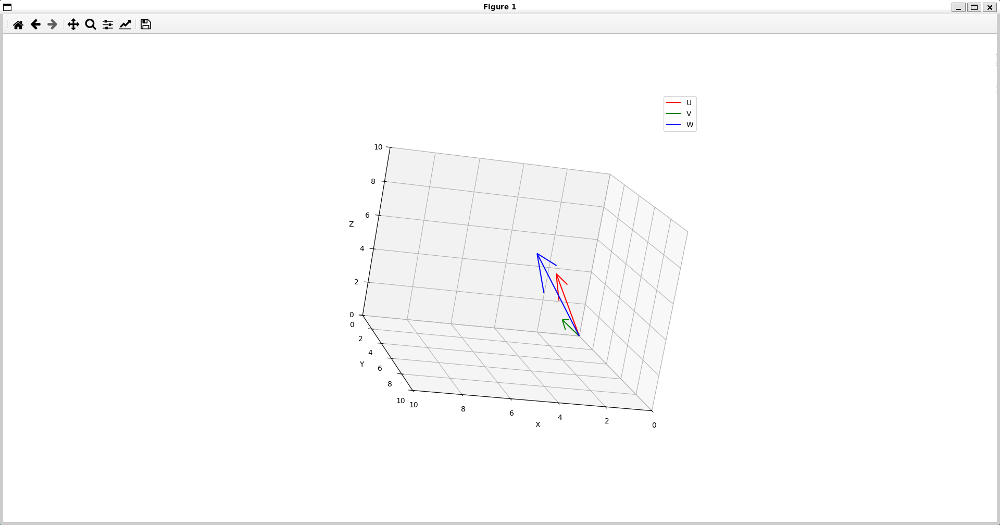
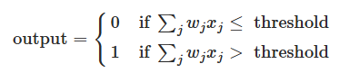
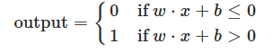
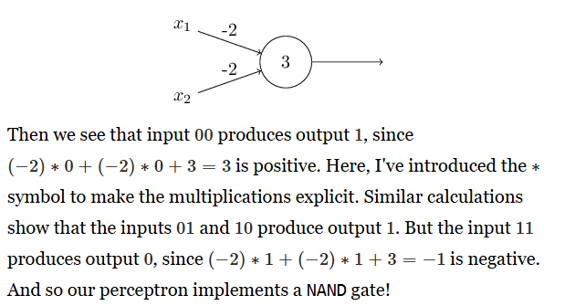
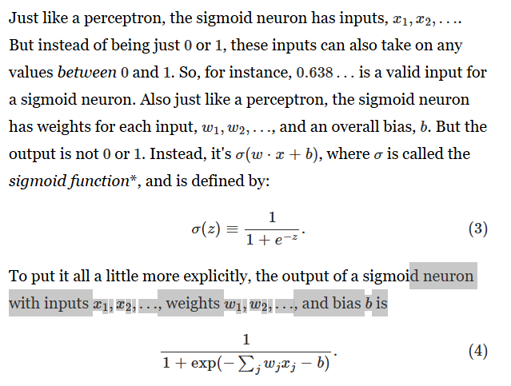
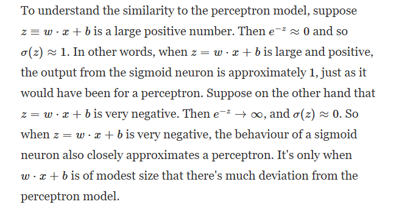
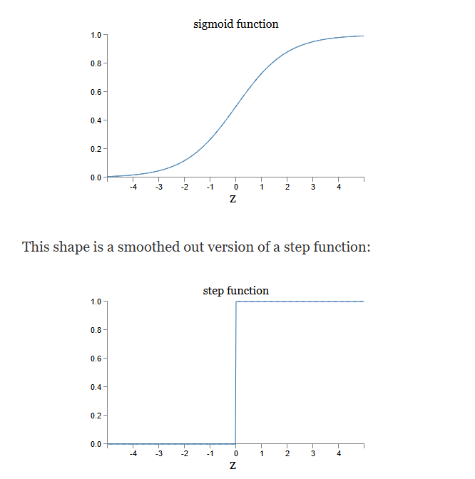
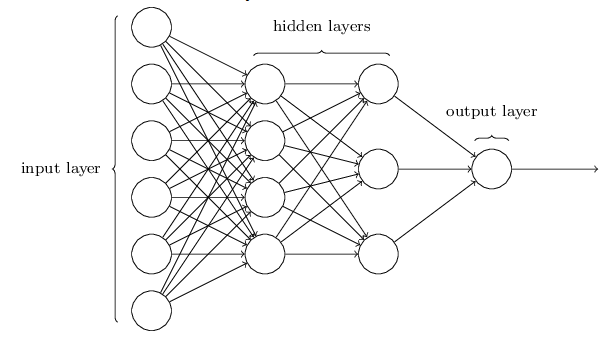
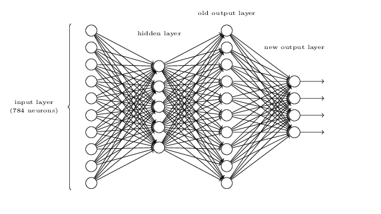
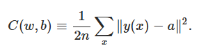

# ALGEBRA LINEARE 

### MATRICI
le matrici sono array contenenti numeri organizzati in row e colonne. <br>
Le dimensioni di una matrice viene data dalle row e colonne, una matrice con solo una row viene detta **row matrix**, invece una matrice con solo una colonna viene detta **column matrix** e una matrice con row e colonne uguali viene detta **square matrix**. <br>
Per selezionare un elemento dentro alla matrice si fa riferimento A[i,j] es A[1,3]

### ADDIZIONI CON MATRICI 
Per eseguire un addizioni con matrici le loro dimensioni devono essere uguali 


### MOLTIPLICAZIONE SCALARE
una moltiplicazione tra un valore c e la matrice A è calcolata moltiplicando tutti gli elementi con c 


### SOTTRAZIONE 
la sottrazione tra due matrici è come la addizione ma bisogna moltiplicare i valori di una matrice per -1

### MOLTIPLICAZIONE CON MATRICI
una moltiplicazione tra matrici si può avere solo se il numero di colonne della prima matrice è uguale al numero di row della seconda matrice 


### TRASPOSIZIONE 
Una trasposizione di una matrice A di dimensioni m x n è formata dalla trasformazione delle row in colonne e vice versa 


ci sono delle proprietà dei numeri che si utilizzano anche con le matrici 

- A + B = B + A
- (cA)<sup>T</sup>  = c(A<sup>T</sup>)
- A<sup>T</sup> + B<sup>T</sup> = (A + B)<sup>T</sup>
- (A<sup>T</sup>)<sup>T</sup> = A


# IMMAGINE VETTORI 




# LIBRO

```markdown
modello tipo **perceptrons**/**percettore** prende vari input x1, x2, x3 e produce un singolo output, per calcolare l'output si introducono i **weights**, l'output di questa rete neurale è 0 o 1 ed è determinata se la somma delle weight nè maggiore di una threshold.
al cambiare delle weight e della treshold possiamo ottenere diversi modelli di processo decisionale
```


[es. vedere libro link](http://neuralnetworksanddeeplearning.com/chap1.html)

ora la nostra equazione può essere riscritta come 



in cui tutti e i tre parametri sono vettori la x di lunghezza 1 x d_model (che d_model è 512) nel paper transformers la W sarà di 512 x 2048 e la bias di 1 x 2048 (queste lunghezze sono solo nella trasformazione lineare perchè nella seconda bisogna trasformare l'output di questa eqauzione a dimensioni di d_model)

quando la bias è molto alta è più facile che l'output sia 1 <br><br><br><br>





per permettere alla rete di migliorare bisognerebbe fare piccoli cambiamenti alle weight e alle bias cosic he l'output cambi. <br> Ma bisogna stare attenti essendo che un cambiamento delle bias o weight potrebbe cambiare il cambiamennto della rete neurale. <br>
Per evitare questo problema allora si introduce un nuovo neurone chiamato **sigmoid neuron** che assomiglia molto al percettore ma gli input possono avere valori tra 0 e 1 invece di 0 o 1 come nel percettore e l'output non è 0 o 1 **ma un valore tra 0 e 1** <br>

 <br>



la sigmod function in alcuni dsa l'output tra un valore 0 e 1 e quando z tende ad essere un valore negativo molto grande l'output della funzione sarà 1 invece quando la z assume un valore positivo molto grande allora l'output della funzione sarà 0. <br>
In questi due casi la funzione assomiglia molto al percettrone.

### Forme Funzioni




Si può notare che la funzione sigmod è una fuznione più 'levigata' rispetto al percettrone. <br>

Queste due funzioni sono chiamate activation function 
(Una funzione di attivazione in una rete neurale è una funzione matematica che determina se un neurone deve essere attivato in base ai suoi segnali di ingresso.)
  

La rete neurale è composta da input layer in cui ci sono gli input x1, x2 ,x3. L'hidden layer significas 'non un input e non un output', invece l'output layer è lo stato in cui fuoriesce l'output <br>



Una rete in cui l'output del layer viene usato come input per il prossimo layer viene chiamato **feedFoward** 

<br> <br>

questa rete da un output in binario della rappresentazione di un numero 
es. 2 si illuminano 0010




In questo caso, si vuole scegliere un set di pesi (weights) e bias tale da illuminare i bit necessari per rappresentare il numero. Nel vecchio output layer, si illumina un neurone in base all’input: se l’input è 2, si illumina il terzo neurone e la sequenza diventa [0, 0, 0.99, 0, 0, 0, 0, 0, 0, 0].
Per scegliere i pesi, si fa in modo che siano abbastanza grandi da far sì che la funzione sigmoide restituisca 0.99 (e non 0.01). Ad esempio:  
- Il primo neurone, che rappresenta il bit più significativo, ha pesi [0, 0, 0, 0, 0, 0, 0, 0, 10, 10];  

- Il secondo ha [0, 0, 0, 0, 10, 10, 10, 10, 0, 0];  

- Il terzo ha [0, 0, 10, 10, 0, 0, 10, 10, 0, 0]; 

- Il quarto ha [0, 10, 0, 10, 0, 10, 0, 10, 0, 10].

Questo avviene perché, per esempio, il primo neurone deve illuminarsi solo quando l’input è 8 o 9, dato che le loro rappresentazioni binarie sono 1000 (8) e 1001 (9). La bias, invece, viene scelta uguale a -5. <br>
Con un input pari a 2, si dovrebbe illuminare il terzo neurone del quarto strato. Nei pesi del terzo neurone, [0, 0, 10, 10, 0, 0, 10, 10, 0, 0], si nota che la posizione 2 (che corrisponde alla cifra 2) ha un peso di 10. Così, quando si calcola la somma pesata con l’equazione xi*wi + b
, si moltiplica [0, 0, 0.99, 0, 0, 0, 0, 0, 0, 0] per i pesi del terzo neurone [0, 0, 10, 10, 0, 0, 10, 10, 0, 0]. Il risultato è 10⋅0.99+(−5)=9.9−5=4.9.<br>
Inserendo 4.9 nella funzione sigmoide, si ottiene circa 0.99, permettendo di illuminare il bit 3. Per gli altri neuroni, invece, il risultato è 0.
Ad esempio, moltiplicando [0, 0, 0.99, 0, 0, 0, 0, 0, 0, 0] per i pesi del secondo neurone [0, 0, 0, 0, 10, 10, 10, 10, 0, 0], si ottiene 0; quindi z=0+(−5)=−5z = 0 + (-5) = -5z = 0 + (-5) = -5
. Messo nella sigmoide, -5 restituisce circa 0.01, quindi il secondo neurone non si illumina. Lo stesso vale per gli altri neuroni.

Ovviamente il processo di trovare le weight e le bias avviene tramite una funzione 



- w sono le weight 
- b è la bias
- n sono il totale di inpunt per il training
- a è l'output per ogni xn quindi nel contesto di pirma sarebbe a=[0.01, 0.01, 0.99, 0.01]
- y(x) è il valore che il modello dovrebbe produrre per un dato input ( x ) 
- la somma è su tutti gli input nel trainig set 

- || ∣∣y(x)−a∣∣<sup>2</sup>=
(y(x)1−a1)<sup>2</sup>+(y(x)2−a2)<sup>2</sup>+...+ (y(x)n−an)<sup>2</sup>


se questa funzione raggiunge presso che 0 allora si sono trovate un ottimo set di bias e weight se invece raggiunge un numero grande allora l'algoritmo non sta andando bene questa perchè nella loss function più il valore è basso e migliore è il nostro algoritmo.
Questo perchè più i valori di a che sarebbe l'output del nostro modello e i valori di f(x) sono uguali la funzione tenderà a 0 

es. y(x)=[0, 0, 1, 0],a=[0.01, 0.01, 0.99, 0.01] <br>
y(x) − a=[0 − 0.01, 0 − 0.01, 1 − 0.99 , 0 − 0.01]=[−0.01, −0.01, 0.01, −0.01] <br>
∣∣y(x)−a∣∣<sup>2</sup>=(−0.01)<sup>2</sup>+(−0.01)<sup>2</sup>+(0.01)<sup>2</sup>+(−0.01)<sup>2</sup>=4 * (0.01)<sup>2</sup>=0.0004


