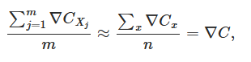

### ALGEBRA LINEARE
### MATRICI
Le matrici sono array di numeri organizzati in righe e colonne.
Le dimensioni di una matrice sono definite dal numero di righe e colonne. Una matrice con una sola riga è detta matrice riga, una matrice con una sola colonna è detta matrice colonna e una matrice con lo stesso numero di righe e colonne è detta matrice quadrata.
Per selezionare un elemento nella matrice si usa la notazione A[i,j], ad esempio A[1,3].
### ADDIZIONE DI MATRICI
Per eseguire l'addizione di due matrici, le loro dimensioni devono essere uguali. 
Addizione di matrici

### MOLTIPLICAZIONE SCALARE
La moltiplicazione scalare tra un numero c e una matrice A si ottiene moltiplicando ogni elemento della matrice per c.  
Moltiplicazione scalare

### SOTTRAZIONE
La sottrazione tra due matrici è simile all'addizione, ma si moltiplicano gli elementi di una delle due matrici per -1.
### MOLTIPLICAZIONE DI MATRICI
La moltiplicazione tra due matrici è possibile solo se il numero di colonne della prima matrice è uguale al numero di righe della seconda matrice.  
Moltiplicazione di matrici

### PRODOTTO DI HADAMARD
Il prodotto di Hadamard è una moltiplicazione tra due matrici della stessa dimensione che restituisce una matrice della stessa dimensione. 
Prodotto di Hadamard

### TRASPOSIZIONE
La trasposizione di una matrice A di dimensioni m × n consiste nello scambiare le righe con le colonne e viceversa.  
Trasposizione

### PROPRIETÀ
Alcune proprietà delle matrici sono analoghe a quelle dei numeri reali:
A + B = B + A
(cA)T = c(AT)
AT + BT = (A + B)T
(AT)T = A

# IMMAGINE VETTORI 

# LIBRO

# Fondamenti di Reti Neurali

## Percettone

Il **percettone** (o **perceptron** in inglese) è un modello base di rete neurale che riceve più input (**x1, x2, x3**, ecc.) e produce un singolo output. Per calcolare l'output, si introducono i **pesi** (weights), che determinano l'importanza di ciascun input. L'output del percettone è binario (**0** o **1**) e dipende dal confronto tra la somma pesata degli input e una **soglia** (threshold): se la somma supera la soglia, l'output è **1**, altrimenti è **0**.

Modificando i pesi e la soglia, è possibile ottenere diversi modelli di processo decisionale.

Per un esempio dettagliato, consulta il libro: [Neural Networks and Deep Learning](http://neuralnetworksanddeeplearning.com/chap1.html).

## Formulazione Matematica

L'equazione del percettone può essere riscritta in forma matriciale come:

Dove:
- **x** è un vettore di input di dimensione **1 × d_model** (ad esempio, **d_model = 512** nel caso dei transformer).
- **W** è una matrice di pesi di dimensione **512 × 2048** (nel contesto di una trasformazione lineare nei transformer).
- **b** è un vettore di bias di dimensione **1 × 2048**.

Questa equazione rappresenta la trasformazione lineare. Per riportare l'output alla dimensione **d_model**, è necessaria una successiva trasformazione.

Un valore elevato del **bias** aumenta la probabilità che l'output sia **1**.

## Aggiustamento dei Parametri

Per migliorare le prestazioni della rete, è necessario modificare gradualmente i **pesi** e il **bias** in modo da ottimizzare l'output. Tuttavia, bisogna fare attenzione: una variazione troppo grande di questi parametri può alterare significativamente il comportamento della rete.

## Neurone Sigmoide

Per superare i limiti del percettone, si introduce il **neurone sigmoide**, che è simile al percettone ma più flessibile. A differenza del percettone, i cui input e output sono binari (**0** o **1**), il neurone sigmoide accetta input e produce output con valori continui compresi tra **0** e **1**.

La **funzione sigmoide** mappa l'input **z** in un intervallo tra **0** e **1**. Quando **z** è un valore molto grande e positivo, l'output tende a **1**; quando **z** è molto grande e negativo, l'output tende a **0**. In questi casi estremi, il comportamento del neurone sigmoide è simile a quello del percettone.

## Forme delle Funzioni

La funzione sigmoide si distingue per essere più "levigata" rispetto alla funzione di attivazione del percettone, che produce un output binario netto (**0** o **1**).

Queste funzioni sono note come **funzioni di attivazione**. Una funzione di attivazione in una rete neurale è una funzione matematica che determina se un neurone deve essere attivato in base ai suoi segnali di ingresso.

## Struttura di una Rete Neurale

Una rete neurale è composta da tre tipi principali di strati:
- **Input layer**: il livello iniziale che riceve gli input, come **x1, x2, x3**, ecc.
- **Hidden layer**: i livelli intermedi, che non sono né input né output, ma elaborano i dati.
- **Output layer**: il livello finale che produce l'output della rete.

Una rete in cui l'output di un livello viene utilizzato come input per il livello successivo è chiamata **feedforward**.

## Esempio di Output Binario

In alcune reti neurali, l'output rappresenta un numero in forma binaria. Ad esempio, il numero **2** può essere rappresentato come **0010**, dove i bit corrispondenti si "illuminano" nell'output.

In questo caso, l'obiettivo è scegliere un insieme di **pesi** (weights) e **bias** che permettano di attivare i neuroni corretti per rappresentare il numero desiderato. Ad esempio, per l'input **2**, il terzo neurone dell'output layer si attiva, producendo una sequenza come **[0, 0, 0.99, 0, 0, 0, 0, 0, 0, 0]**.

Per ottenere questo risultato, i pesi devono essere scelti in modo che la funzione sigmoide restituisca un valore vicino a **0.99** (anziché **0.01**) per il neurone corrispondente. Un esempio di configurazione dei pesi per i neuroni dell'output layer è il seguente:
- Primo neurone (bit più significativo): **[0, 0, 0, 0, 0, 0, 0, 0, 10, 10]**.
- Secondo neurone: **[0, 0, 0, 0, 10, 10, 10, 10, 0, 0]**.
- Terzo neurone: **[0, 0, 10, 10, 0, 0, 10, 10, 0, 0]**.
- Quarto neurone: **[0, 10, 0, 10, 0, 10, 0, 10, 0, 10]**.

## Ottimizzazione dei Pesi e del Bias

Per esempio, il primo neurone dell'output layer deve attivarsi ("illuminarsi") solo quando l'input è **8** o **9**, poiché le loro rappresentazioni binarie sono **1000** (8) e **1001** (9). Il **bias** viene scelto, ad esempio, come **-5**.

Con un input pari a **2**, il terzo neurone del quarto strato (output layer) deve attivarsi. I pesi del terzo neurone sono **[0, 0, 10, 10, 0, 0, 10, 10, 0, 0]**. Si nota che la posizione corrispondente alla cifra **2** (terza posizione) ha un peso di **10**. Calcolando la somma pesata con l'equazione **∑(xᵢ * wᵢ) + b**, si moltiplica il vettore di input **[0, 0, 0.99, 0, 0, 0, 0, 0, 0, 0]** per i pesi del terzo neurone **[0, 0, 10, 10, 0, 0, 10, 10, 0, 0]**. Il risultato è:

**10 * 0.99 + (-5) = 9.9 - 5 = 4.9**

Inserendo **4.9** nella funzione sigmoide, si ottiene un valore di circa **0.99**, che permette di attivare il terzo neurone (bit 3). Per gli altri neuroni, il risultato è prossimo a **0**. Ad esempio, moltiplicando il vettore di input **[0, 0, 0.99, 0, 0, 0, 0, 0, 0, 0]** per i pesi del secondo neurone **[0, 0, 0, 0, 10, 10, 10, 10, 0, 0]**, si ottiene:

**0 + (-5) = -5**

Inserendo **-5** nella funzione sigmoide, si ottiene circa **0.01**, quindi il secondo neurone non si attiva. Lo stesso vale per gli altri neuroni.

## Funzione di Costo

Il processo di determinazione dei **pesi** (weights) e del **bias** avviene ottimizzando una **funzione di costo** (loss function):

Dove:
- **w** rappresenta i pesi.
- **b** rappresenta il bias.
- **n** è il numero di esempi utilizzati nel training set.
- **a** è l'output del modello per un dato input **x** (ad esempio, **a = [0.01, 0.01, 0.99, 0.01]** nel contesto precedente).
- **y(x)** è il valore atteso che il modello dovrebbe produrre per un dato input **x**.
- La somma è calcolata su tutti gli input del training set.

La funzione di costo è definita come:

**||y(x) - a||² = (y(x)₁ - a₁)² + (y(x)₂ - a₂)² + ... + (y(x)ₙ - aₙ)²**

Se il valore della funzione di costo è vicino a **0**, significa che i pesi e il bias sono ottimali, poiché l'output del modello (**a**) è molto simile al valore atteso (**y(x)**). Se invece il valore è grande, l'algoritmo non sta performando bene, perché la differenza tra **a** e **y(x)** è significativa.

### Esempio
Supponiamo che **y(x) = [0, 0, 1, 0]** e **a = [0.01, 0.01, 0.99, 0.01]**. La differenza è:

**y(x) - a = [0 - 0.01, 0 - 0.01, 1 - 0.99, 0 - 0.01] = [-0.01, -0.01, 0.01, -0.01]**

La funzione di costo è:

**||y(x) - a||² = (-0.01)² + (-0.01)² + (0.01)² + (-0.01)² = 4 * (0.01)² = 0.0004**

Un valore basso come **0.0004** indica che il modello è ben ottimizzato.

## Discesa del Gradiente

La tecnica della **discesa del gradiente** (gradient descent) viene utilizzata per trovare i valori di **pesi** e **bias** che minimizzano la funzione di costo. Questo processo iterativo regola gradualmente i parametri per ottenere una funzione di costo più bassa possibile. 

## Discesa del Gradiente e Ottimizzazione della Funzione di Costo

Per comprendere come la **funzione di costo** (**C**) cambia al variare dei parametri (ad esempio, pesi e bias), si utilizza la seguente equazione, che fornisce una stima del cambiamento della funzione di costo quando si aggiornano i parametri:

Questa equazione rappresenta il cambiamento approssimativo della funzione di costo (**ΔC**) quando i parametri **v₁** e **v₂** (che possono rappresentare i pesi **w** o il bias **b**) vengono modificati di una quantità **Δv₁** e **Δv₂**.

Il **gradiente** della funzione di costo (**∇C**) è definito come il vettore delle derivate parziali:
$\frac{∂C}{∂v1}$ e $\frac{∂C}{∂v2}$

Le derivate parziali $\frac{∂C}{∂v1}$ e $\frac{∂C}{∂v2}$ rappresentano il tasso di variazione della funzione di costo rispetto ai parametri **v₁** e **v₂** (ad esempio, un peso o il bias). In termini più semplici, la derivata misura quanto cambia il valore della funzione di costo quando un parametro varia di una piccola quantità. Graficamente, la derivata corrisponde alla pendenza della funzione in un dato punto.

### Aggiornamento dei Parametri

I cambiamenti dei parametri **Δv₁** e **Δv₂** sono gli "steps" utilizzati per ridurre il valore della funzione di costo, seguendo la direzione opposta al gradiente (**-∇C**). Questi sono calcolati come:

**Δv₁** = $\frac{∂C}{∂v1}$ * **η** e **Δv₂** = $\frac{∂C}{∂v2}$ * **η**

Dove:
- **η** (eta) è il **learning rate**, un valore piccolo che determina l'entità del passo nella discesa del gradiente.
- Il segno negativo (**-**) indica che ci si muove nella direzione opposta al gradiente per minimizzare la funzione di costo.

Il **learning rate** è cruciale:
- Se è troppo piccolo, l'algoritmo richiede molti passi per raggiungere il minimo, rallentando il processo.
- Se è troppo grande, l'algoritmo può "saltare" il minimo, causando **divergenze** e impedendo la convergenza.

L'equazione completa della discesa del gradiente può essere riscritta come:

Qui, **ΔC** è approssimativamente il prodotto scalare tra il gradiente **∇C** e il vettore dei cambiamenti dei parametri (**Δv**), che a sua volta dipende dal gradiente e dal learning rate.

**Nota**: I gradienti degli input non vengono modificati, poiché gli input sono fissi e non sono parametri ottimizzabili.

### Processo di Ottimizzazione

Per aggiornare i pesi e il bias, si segue questo processo iterativo:
1. Calcolare la **funzione di costo** (**C**) con i pesi e il bias attuali.
2. Calcolare il **gradiente** (**∇C**) e determinare il cambiamento approssimativo (**ΔC**) utilizzando l'equazione del gradiente. Questo indica di quanto dovrebbe diminuire l'errore con i nuovi pesi e bias.
3. Aggiornare i pesi e il bias usando il learning rate e il gradiente, calcolando i nuovi parametri come:

W = W - $\frac{η}{totInput}$ * $\frac{∂C}{∂W}$,   B = B - $\frac{η}{totInput}$ * $\frac{∂C}{∂B}$

4. Ricalcolare la funzione di costo (**C**) con i nuovi pesi e bias.
5. Verificare che la differenza tra la funzione di costo iniziale (passo 1) e quella aggiornata (passo 4) sia coerente con il cambiamento stimato (**ΔC**) del passo 2.

# Fondamenti di Reti Neurali

## Obiettivo della Discesa del Gradiente

L'idea principale della **discesa del gradiente** è trovare i valori di **pesi** e **bias** che minimizzano la **funzione di costo**. Muovendosi nella direzione opposta al gradiente (**-∇C**), si riduce progressivamente il valore della funzione di costo, avvicinandosi al minimo globale o locale.

## Discesa del Gradiente Stocastica (Stochastic Gradient Descent)

Quando il dataset è molto grande, calcolare il gradiente su tutti gli esempi può essere computazionalmente costoso. In questi casi, si utilizza la **discesa del gradiente stocastica** (SGD), che seleziona un sottoinsieme casuale di esempi, chiamato **mini-batch**, per calcolare il gradiente e aggiornare i parametri.

- **m** rappresenta la dimensione del mini-batch, che deve essere minore della dimensione del dataset (**n**), cioè **m < n**.
- Gli esempi nel mini-batch devono essere scelti **casualmente** dal dataset per garantire rappresentatività.

La discesa del gradiente stocastica si basa sulla **legge dei grandi numeri**:

> Secondo la legge dei grandi numeri, la media calcolata su un numero sufficiente di campioni casuali è ragionevolmente vicina alla media reale, cioè quella calcolabile teoricamente sull'intero dataset.

### Epoche e Aggiornamenti

Il processo di SGD si ripete più volte, aggiornando i **pesi** e il **bias** per ogni mini-batch. Una volta elaborati tutti gli esempi del dataset (completando un'**epoca**), si ricomincia dal dataset, ma con mini-batch diversi. Questo processo è intrinsecamente casuale, quindi gli stessi esempi possono apparire più volte in epoche diverse.

**Esempio**:
- Dataset: **[1, 2, 3, 4, 5, 6]**
- Prima epoca: mini-batch **[3, 5]**, **[6, 1]**, **[4, 2]**
- Seconda epoca: mini-batch **[3, 5]**, **[6, 1]**, **[4, 6]**

Questo processo casuale è detto **epoca** e può includere ripetizioni di esempi all'interno dello stesso ciclo, poiché la selezione è stocastica.

### Vantaggi della Discesa del Gradiente Stocastica

La **discesa del gradiente stocastica** offre diversi vantaggi rispetto alla **discesa del gradiente** classica (GD), specialmente per dataset grandi:
- **Velocità**: Elaborare mini-batch più piccoli è molto più rapido rispetto a calcolare il gradiente sull'intero dataset.
- **Aggiornamenti frequenti**: I pesi e i bias vengono aggiornati più spesso, consentendo un apprendimento più rapido.
- **Efficienza computazionale**: Con milioni o miliardi di parametri, elaborare l'intero dataset in una volta sarebbe troppo oneroso per l'hardware.

#### Confronto tra GD e SGD

**Esempio con un dataset di 1.000.000 immagini**:

**Discesa del Gradiente (GD)**:
- Si calcola il gradiente sull'intero dataset di 1.000.000 immagini.
- Un aggiornamento richiede, ad esempio, **600 secondi** (10 minuti) a causa del volume di dati.
- Dopo **10 epoche** (10 aggiornamenti), il tempo totale è:
10 × 600= 6.000 secondi (100 minuti).

**Discesa del Gradiente Stocastica (SGD, batch size = 32)**:
- Ogni mini-batch di 32 immagini richiede **0,02 secondi**.
- Un'epoca comprende:

$\frac{1.000.000}{32}$  = 31.250 che sarebbero la quantità dei mini-batch, 

- Il tempo per un'epoca è:
31.250 × 0,02 = 625 secondi che sarebbero 10 minuti

- Se il modello raggiunge una buona funzione di costo dopo **5 epoche**, il tempo totale è:
5x625 = 3125 secondi che in minuti risulterebbe 52 

In questo caso, l'SGD è significativamente più veloce e può convergere a una soluzione accettabile in meno tempo rispetto alla GD.

# Fondamenti di Reti Neurali

## Considerazioni sulla Discesa del Gradiente Stocastica

Non è corretto assumere che la **discesa del gradiente stocastica** (SGD) garantisca una buona **funzione di costo** dopo un numero fisso di epoche (ad esempio, 5). La velocità con cui SGD converge al minimo della funzione di costo dipende da diversi fattori, come la dimensione del **mini-batch**, il **learning rate**, la complessità del modello e la natura del dataset. Tuttavia, SGD è generalmente più veloce della **discesa del gradiente** classica (GD) per dataset grandi, poiché aggiorna i parametri più frequentemente utilizzando sottoinsiemi di dati.

## Backpropagation e Discesa del Gradiente

Un chiarimento importante è che il processo di ottimizzazione non si limita alla **discesa del gradiente**. La **backpropagation** (retropropagazione) è un algoritmo complementare che lavora in tandem con la discesa del gradiente. In particolare:
- La **backpropagation** calcola i **gradienti** della funzione di costo rispetto a ogni **peso** e **bias** della rete, determinando gli "step" necessari per ridurre la funzione di costo.
- La **discesa del gradiente** utilizza questi gradienti per aggiornare i parametri (pesi e bias) nella direzione che minimizza la funzione di costo.

Questi due algoritmi collaborano per ottimizzare la rete neurale.

## Backpropagation

L'obiettivo della **backpropagation** è calcolare le **derivate parziali** della **funzione di costo** (**C**) rispetto a ogni peso (**w**) e bias (**b**) della rete. Questo permette di capire come la funzione di costo cambia al variare di ciascun parametro.

La backpropagation utilizza la regola della catena per propagare all'indietro gli errori dalla funzione di costo attraverso i vari strati della rete, calcolando in modo efficiente:

$\frac{∂C}{∂W}$,   $\frac{∂C}{∂B}$

Queste derivate rappresentano il **tasso di variazione** della funzione di costo rispetto a ciascun parametro, indicando come modificare i pesi e i bias per ridurre l'errore.

### Processo
1. **Calcolo in avanti (forward pass)**: Si calcola l'output della rete per un dato input, passando attraverso tutti i layer.
2. **Calcolo della funzione di costo**: Si confronta l'output previsto con il valore atteso per determinare l'errore.
3. **Calcolo all'indietro (backward pass)**: Si calcolano i gradienti della funzione di costo rispetto a ogni parametro, partendo dall'output e procedendo verso l'input.
4. **Aggiornamento dei parametri**: I gradienti calcolati vengono utilizzati dalla discesa del gradiente (o SGD) per aggiornare i pesi e i bias, utilizzando il **learning rate**:

W = W - $\frac{η}{totInput}$ * $\frac{∂C}{∂W}$,  B = B - $\frac{η}{totInput}$ * $\frac{∂C}{∂B}$

Questo processo si ripete per ogni mini-batch (nel caso di SGD) o per l'intero dataset (nel caso di GD), iterando su più epoche fino a raggiungere una funzione di costo sufficientemente bassa.

# PAPER: Neural Machine Translation by Jointly Learning to Align and Translate

### Introduzione a attention

modello composto da encoder e decoder 

encoder prende come input x1, x2, ..., xn
e da come output h1, h2, ..., hn in cui ogni h è un vettore che contiene informazioni sulla parola xn

invece il decoder per generare una parola ha bisogno di:
- G sarebbe la rete neurale del decoder di solito con una softamax alla fine 
- s è un arappresentazione astratta della frase (in vettori)
- y - 1 è la parola generata dal decoder 
- c che sarebbe un vettore di contesto 

dove **eij=a(s0, hj)** e **a** sarebbe una rete neurale feedfoward 
questa funzione a dice quanto è rilevante hj rispetto a s0 (quindi per la parola 0 essendo che non si è ancora prodotto nessun stato nascosto ) e quindi per ogni parola produce un valore 

una volta calcolata **e** si calcolano i pesi a (**CHE NON SAREBBERO I PARAMETRI DELLA RETE NEURALE**) per ogni singola parola e alla fine si calcola il vettore di contesto e e grazie a questo si può capire chi ha più peso (chi è più importante) con s (in questo casso s0 perchè sarebbe la prima parola)

the cat is on the table  c sarebbe = 0.30*h1, 0.50*h2, 0.07*h3, 0.04*h4, 0.03*h5, 0.03*h6 
i numeri che vengono moltiplicati con hn sarebbero i pesi **a**. Si può notare che ogni volta che s cambia essendo che il decoder producerà una parola i pesi **a** a sua volta cambiano. Con questo processo con **C** e i suoi pesi **a** si cerca di far targhettizzare/puntare **Y** cioè l'output del decoder con **x** 

Una volta che si ha il contesto del vettore C allora si può creare la parola con il decoder:

- G sarebbe la rete neurale del decoder di solito con una softamax alla fine 
- s è lo stato nascosto iniziale (le parole elaborate fino ad ora)
- y - 1 l'output prodotto dal decoder 
- c vettor eid ocntesto calcolato soppra 

questo deoder per esempio produce una probabilità sulle parole del vocabolario e quindi tramite e quindi con questi tre input il deocder potrebbe dare una probabilità alta a il 

dopo aver prodotto l'output rigenera tutto quello descritto sopra tranne le h essendo che una volta create si utilizzano sempre quelle ma invece si ricalcola il vettore di contesto C anche le y - 1 è aggiornata essendo che si è aggiunta una parola e anche lo stato nascosto 

