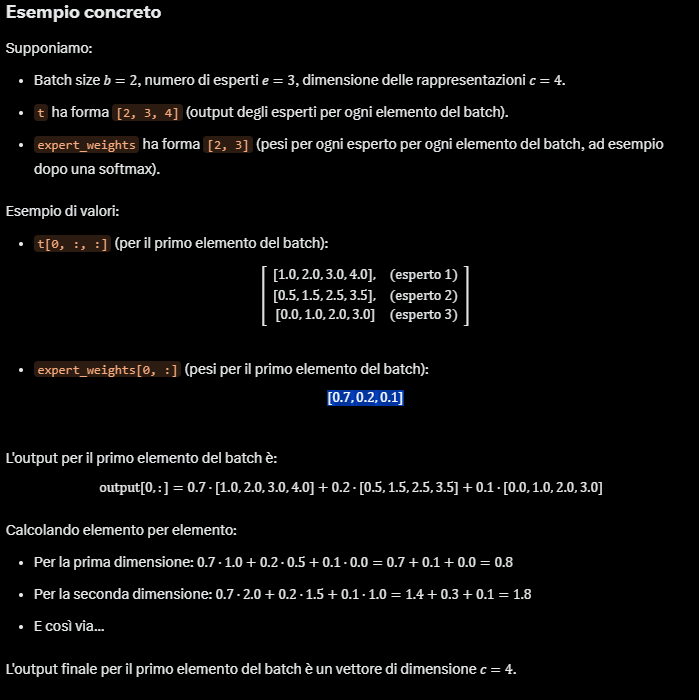

hyperparameter del modello rilasciato da openIA
```
@dataclass
class ModelConfig:
    num_hidden_layers: int = 36
    num_experts: int = 128
    experts_per_token: int = 4
    vocab_size: int = 201088
    hidden_size: int = 2880
    intermediate_size: int = 2880
    swiglu_limit: float = 7.0
    head_dim: int = 64
    num_attention_heads: int = 64
    num_key_value_heads: int = 8
    sliding_window: int = 128
    initial_context_length: int = 4096
    rope_theta: float = 150000.0
    rope_scaling_factor: float = 32.0
    rope_ntk_alpha: float = 1.0
    rope_ntk_beta: float = 32.0
```

- vocab_size: Il vocab_size rappresenta il numero di token unici nel vocabolario del modello.
- hidden_size: Il hidden_size rappresenta la dimensione del vettore di rappresentazione di ogni token nelle fasi interne del modello.
- head_dim: consiste nella dimensione di ogni teste di attenzione (Q, K, V) all'interno del blocco di attention.
- num_attention_heads: consiste nella quantità di heads in ogni blocco di attention, quindi il totale di head del modello viene dato da num_hidden_layers x num_attention_heads, questo parametro fa riferimento solo alle heads delle query.
- num_key_value_heads: Il num_key_value_heads rappresenta il numero di teste di attention per key e value, che in configurazioni come Grouped Query Attention è inferiore al numero di teste per le query.
- num_hidden_layers: numero  di layer all'interno dell'architettura del modello.
- swiglu_limit: parametro usato nella activation function nel blocco del MLP (multi-layer perceptron)
questo parametro serve per fare si che i valori dentro alla funzione di attivazione siano compresi tra un minimo ad un massimo. <br>
Nella funzione di attivazione, il parametro è usato come segue:    
x_glu = x_glu.clamp(min=None, max=limit)
x_linear = x_linear.clamp(min=-limit, max=limit)
quando il min è impostato a None allora non ci sarà un minimo in questo caso.
- intermediate_size: consiste nella dimensione dei parametri weight e bias nel blocco del MLP, dentro alla classe MLPBlock viene raddoppiato, quindi il vettore processato al suo interno diventerà il doppio.
- num_experts: parametro usato nell MLP nell'architettura Mixture of Experts
- experts_per_token: indica quanti experts sono usati per processare i token 
- initial_context_length: quantità di token che il modello può processare alla volta
- sliding_window: quantità di possibili token che il token può gurdare dietro se stesso duranante il meccanismo di attention 

classe Transformer è formata da:
- self.embedding: consiste nel Emebedding del token che va da **config.vocab_size**, fino a n_embedding, qua invece lo chiamano **config.hidden_size**
- self.block: consiste nella quantità di layer che compongono l'architettura, questo è dato da **config.num_hidden_layers**
- self.norm: consiste nella normalizzazione **dell'hidden_state** cosi che abbiano un valore coerente e non troppo diverso tra di loro 
- self.unembedding: converte **l'hidden_state** in logit cosi che ogni token abbia un valore per ogni token nel **vocab_size**, dopo che si applica la softamx questi diventano probabilità permettendo al modello di prevedere il prossimo token.

```
    def __init__(
        self,
        config: ModelConfig,
        device: torch.device | None = None,
    ):
        super().__init__()
        self.embedding = torch.nn.Embedding(
            config.vocab_size, config.hidden_size, device=device, dtype=torch.bfloat16
        )
        self.block = torch.nn.ModuleList(
            [
                TransformerBlock(config, layer_idx, device)
                for layer_idx in range(config.num_hidden_layers)
            ]
        )
        self.norm = RMSNorm(config.hidden_size, device=device)
        self.unembedding = torch.nn.Linear(
            config.hidden_size,
            config.vocab_size,
            bias=False,
            device=device,
            dtype=torch.bfloat16,
        )
        
    def forward(self, x: torch.Tensor) -> torch.Tensor:
        x = self.embedding(x)
        for block in self.block:
            x = block(x)
        x = self.norm(x)
        x = self.unembedding(x)
        return x

```

Blocco di TransformerBlock formato da:
- self.attn: consiste nel blocco di attention
- self.mlp: consiste nel blocco di **multi layer perception** o anche chiamato FFN **feed forward network**

```
    def __init__(
        self,
        config: ModelConfig,
        layer_idx: int,
        device: torch.device | None = None,
    ):
        super().__init__()
        self.layer_idx = layer_idx
        self.attn = AttentionBlock(config, layer_idx, device)
        self.mlp = MLPBlock(config, device)

    def forward(self, x: torch.Tensor) -> torch.Tensor:
        x = self.attn(x)
        x = self.mlp(x)
        return x

```

AttentionBlock non sarebbe la classica attention in cui ogni head utilizza le proprie Q, K ,V.
l'attention usata in gpt-oss è chiamata **Grouped Query Attention**, il suo funzionamento consiste nel usare le K, V per un gruppo di head delle Q in questo caso le head delle Q sono 64 e invece quelle delle K, V sono 8, quindi un gruppo di 8 Q usera solo una delle K, V. <br>
Inoltre al posto di utilizzare la classica position embedding absolute o sinusoidale quella apprendibile utilizza la **Rotary position embedding**  
Blocco di AttentionBlock formato da:

- self.head_dim: consiste nella dimesione di ogni Q, K, V all'interno di ogni head.
- self.num_attention_heads: quantità di head per le Q.
- self.num_key_value_heads: quantità di head per le K, V.
- self.sliding_window: quanità di token a un singolo token può attendere o guardare indietro, questo permette di risparmiare risorse ma il compormesso è che in frasi lunghe i token che sono distanti tra di loro non si relazionano.
- self.sinks: tensor di numeri randomici che viene concatenato durante la scaled dot product attention dopo aver effetuato la maschera, questo permette di abbassare la probabilità di ogni token quando avviene la softmax, perchè si aggiungono valori che verranno sommati al denominatore per ogni token. Questo permette al modello di essere più stabile soprattutto se molto grande.
- self.norm: consiste nella normalizzazione **dell'hidden_state** cosi che abbiano un valore coerente e non troppo diverso tra di loro
- qkv_dim: dimensioni del vettore formato dalle Q, K, V. lunghezza 5120.
- self.qkv: trasformazione lineare standard di torch x*w + q. l'output di questa trasformazione lineare è di **qkv_dim**
- self.out: trasformazione lineare standard di torch x*w + q. l'output di questa trasformazione lineare è di **config.hidden_size**
- self.sm_scale: valore usato per scalare i valori dopo la moltiplicazione delle matrici tra Q e K per far si che i valori non abbiano valori troppo grandi
- self.rope: classe che permette al modello di capire la posizione dei token **Rotary position embedding**

```
   def __init__(
        self,
        config: ModelConfig,
        layer_idx: int = 0,
        device: torch.device | None = None,
    ):
        super().__init__()
        self.head_dim = config.head_dim
        self.num_attention_heads = config.num_attention_heads
        self.num_key_value_heads = config.num_key_value_heads
        # Only apply sliding window to every other layer
        self.sliding_window = config.sliding_window if layer_idx % 2 == 0 else 0
        self.sinks = torch.nn.Parameter(
            torch.empty(config.num_attention_heads, device=device, dtype=torch.bfloat16)
        )
        self.norm = RMSNorm(config.hidden_size, device=device)
        # dimensione delle qkv 33.792
        qkv_dim = config.head_dim * (
            config.num_attention_heads + 2 * config.num_key_value_heads
        )
        self.qkv = torch.nn.Linear(
            config.hidden_size, qkv_dim, device=device, dtype=torch.bfloat16
        )
        self.out = torch.nn.Linear(
            config.head_dim * config.num_attention_heads,
            config.hidden_size,
            device=device,
            dtype=torch.bfloat16,
        )
        self.sm_scale = 1 / math.sqrt(config.head_dim)
        self.rope = RotaryEmbedding(
            config.head_dim,
            config.rope_theta,
            torch.float32,
            initial_context_length=config.initial_context_length,
            scaling_factor=config.rope_scaling_factor,
            ntk_alpha=config.rope_ntk_alpha,
            ntk_beta=config.rope_ntk_beta,
            device=device,
        )
```

il processo principale della classe AttentionBlock è il **scaled dot product attention**

```
def sdpa(Q, K, V, S, sm_scale, sliding_window=0):
    # sliding_window == 0 means no sliding window
    n_tokens, n_heads, q_mult, d_head = Q.shape
    assert K.shape == (n_tokens, n_heads, d_head)
    assert V.shape == (n_tokens, n_heads, d_head)
    K = K[:, :, None, :].expand(-1, -1, q_mult, -1)
    V = V[:, :, None, :].expand(-1, -1, q_mult, -1)
    S = S.reshape(n_heads, q_mult, 1, 1).expand(-1, -1, n_tokens, -1)
    mask = torch.triu(Q.new_full((n_tokens, n_tokens), -float("inf")), diagonal=1)
    if sliding_window > 0:
        mask += torch.tril(
            mask.new_full((n_tokens, n_tokens), -float("inf")), diagonal=-sliding_window
        )
    QK = torch.einsum("qhmd,khmd->hmqk", Q, K)
    QK *= sm_scale
    QK += mask[None, None, :, :]
    QK = torch.cat([QK, S], dim=-1)
    W = torch.softmax(QK, dim=-1)
    W = W[..., :-1]
    attn = torch.einsum("hmqk,khmd->qhmd", W, V)
    return attn.reshape(n_tokens, -1)
```

questo sarebbe come detto prima una variante della classica attention del paper [**Attention is all you need**](https://arxiv.org/abs/1706.03762) perchè consiste in una **Grouped Query Attention**

Il primo passo consiste nel modificare i tensori K e V per allinearli dimensionalmente alle query (Q). Inizialmente, K e V hanno forma [initial_context_length, num_key_value_heads, head_dim]. Con K[:, :, None, :] e V[:, :, None, :], si aggiunge una nuova dimensione, ottenendo [initial_context_length, num_key_value_heads, 1, head_dim]. Successivamente, con .expand(-1, -1, q_mult, -1), questa dimensione viene espansa a q_mult (dove q_mult = num_attention_heads // num_key_value_heads), mentre le altre dimensioni rimangono invariate (-1). Il risultato è un tensore di forma [initial_context_length, num_key_value_heads, q_mult, head_dim], compatibile con Q per il calcolo dell'attenzione.

Il procedimento per calcolare l'attention è uguale a quello del paper ma l'unica differenza è che prima della softmax viene concatenato un tensor S che ho gia spiegato prima

- QK = torch.einsum("qhmd,khmd->hmqk", Q, K) moltiplicazioni tra Q e K 
- QK *= sm_scale valori scalati in modo tale che non raggiungano valori troppo grandi 
- QK += mask[None, None, :, :] aggiunta della mask 
- QK = torch.cat([QK, S], dim=-1) concatenazione del tensore S
- W = torch.softmax(QK, dim=-1) calcolo delle probabilità sull'ultima dimensione
- W = W[..., :-1] rimuove l'ultima colonna dell'ultima dimensione perchè farebbe riferimento al tensore S 
- attn = torch.einsum("hmqk,khmd->qhmd", W, V) moltiplicazione tra tensori di W e V 
- return attn.reshape(n_tokens, -1) ridimensionamento del tensore

MLPBlock (multy layer perception) è la classe che viene subito dopo il blocco AttentionBlock, il blocco della multy layer perception o a volte chiamato **feed foward network** viene inserito cosi da dare al modello la non linearità cosi che il modello riesca ad apprendere relazioni non lineari (pattern o dati che non possono essere descritte con un afunzione lineare).

parametri già spiegati sopra
- self.experts_per_token = config.experts_per_token
- self.swiglu_limit = config.swiglu_limit
- self.world_size: quanti processi (GPU/CPU) si sta usando per l'allenamento del modelo
- self.norm: consiste nella funzione di normalizzazione 
- self.gate: trasformazione lineare
- self.mlp1_weight: pesi della prima trasformazione lineare
- self.mlp1_bias: bias della prima trasformazione lineare
- self.mlp2_weight: pesi della seconda traformazione lineare
- self.mlp2_bias: bias della seconda trasformazione lineare 

```
 self.num_experts = config.num_experts
        self.experts_per_token = config.experts_per_token
        self.swiglu_limit = config.swiglu_limit
        self.world_size = dist.get_world_size() if dist.is_initialized() else 1
        self.norm = RMSNorm(config.hidden_size, device=device)
        self.gate = torch.nn.Linear(
            config.hidden_size, config.num_experts, device=device, dtype=torch.bfloat16
        )
        assert config.intermediate_size % self.world_size == 0
        self.mlp1_weight = torch.nn.Parameter(
            torch.empty(
                (
                    config.num_experts,
                    config.intermediate_size * 2 // self.world_size,
                    config.hidden_size,
                ),
                device=device,
                dtype=torch.bfloat16,
            )
        )
        self.mlp1_bias = torch.nn.Parameter(
            torch.empty(
                (config.num_experts, config.intermediate_size * 2 // self.world_size),
                device=device,
                dtype=torch.bfloat16,
            )
        )
        self.mlp2_weight = torch.nn.Parameter(
            torch.empty(
                (
                    config.num_experts,
                    config.hidden_size,
                    config.intermediate_size // self.world_size,
                ),
                device=device,
                dtype=torch.bfloat16,
            )
        )
        self.mlp2_bias = torch.nn.Parameter(
            torch.empty(
                (config.num_experts, config.hidden_size),
                device=device,
                dtype=torch.bfloat16,
            )
        )
```

- t = self.norm(x): avviene la normalizzazione dell'input questo perchè prima di processare l'input avviene la **residual connection** che consiste in una add e norm. Si esegue una residual connection perchè con modelli molto complessi si richia di avere il problema del [vanishing gradient problem](https://arxiv.org/abs/1211.5063). 
- g = self.gate(t): prima trasformazione lineare che serve per scegliere quali experts processeranno i token

- experts = torch.topk(g, k=self.experts_per_token, dim=-1, sorted=True) 
  expert_weights = torch.nn.functional.softmax(experts.values, dim=1)
  expert_indices = experts.indices
  procedimento della sceglita degli [expert](https://arxiv.org/abs/2403.07816) questo processo avviene solo durante l'allenamento e inferenza e permette di selezzionare un gruppo di neuroni cosi che diminuisca il tempo di allenamento e permette anche di specializzare gli expert in base agli input.

- mlp1_weight = self.mlp1_weight[expert_indices, ...], mlp1_bias = self.mlp1_bias[expert_indices, ...]: selezione dei pesi e delle bias degli expert nella prima trasformaziuone lineare
- t = torch.einsum("beck,bk->bec", mlp1_weight, t) + mlp1_bias: prima trasformazione lineare x*w + b
- t = swiglu(t, limit=self.swiglu_limit): activation function che permette di dare la non linearità
- mlp2_weight = self.mlp2_weight[expert_indices, ...] mlp2_bias = self.mlp2_bias[expert_indices, ...]: selezione dei pesi e delle bias degli expert nella seconda trasformaziuone lineare
-  t = torch.einsum("beck,bek->bec", mlp2_weight, t): seconda trasformazione lineare
- dist.all_reduce(t, op=dist.ReduceOp.SUM): permette di sommare tutti i tensori tra tutti i processi e distribuire il risultato ad essi
- t += mlp2_bias: aggiunta della bias finale
- t = torch.einsum("bec,be->bc", t, expert_weights) si calcolano i pesi degli experts con l'output degli expert scelti 

- return x + t: si fa l'add della residual connection 
```
def forward(self, x: torch.Tensor) -> torch.Tensor:
        t = self.norm(x) 
        g = self.gate(t) 
        experts = torch.topk(g, k=self.experts_per_token, dim=-1, sorted=True) 
        expert_weights = torch.nn.functional.softmax(experts.values, dim=1)
        expert_indices = experts.indices

        mlp1_weight = self.mlp1_weight[expert_indices, ...]
        mlp1_bias = self.mlp1_bias[expert_indices, ...]
 
        t = torch.einsum("beck,bk->bec", mlp1_weight, t) + mlp1_bias
        t = swiglu(t, limit=self.swiglu_limit)

        mlp2_weight = self.mlp2_weight[expert_indices, ...]
        mlp2_bias = self.mlp2_bias[expert_indices, ...]
        t = torch.einsum("beck,bek->bec", mlp2_weight, t)
        if self.world_size > 1:
            dist.all_reduce(t, op=dist.ReduceOp.SUM)
        t += mlp2_bias

        # Weighted sum of experts
        t = torch.einsum("bec,be->bc", t, expert_weights)

        return x + t
```

processo di inferance
TokenGenerator
```
@torch.inference_mode()
    def __init__(self, checkpoint: str, device: torch.device):
        self.device = device
        self.model = Transformer.from_checkpoint(checkpoint, device=self.device)
```

la funzione from_checkpoint permette di caricare la configurazione del modello da un file json
e caricarlo nel modello.
dopo si mette il modelo in eval cosi che non avvengano degli aggiornamenti dei parametri

- my_rank: ritorna il rank (numero) del processo attuale
- world_size: ritorna quanti processi disponibili per il modello
- per_rank_intermediate_size: rappresenta la lunghezza del tensor che ogni processo elaborerà all'interno del MLP

my_rank = dist.get_rank() if dist.is_initialized() else 0
world_size = dist.get_world_size() if dist.is_initialized() else 1
per_rank_intermediate_size = config.intermediate_size // world_size

si esegue un ciclo for su tutti i parametri del modello for name, param in model.named_parameters():
questo ritorna sia il nome del parametri compreso il nome della variabile a cui viene assegnata e anche la loro dimensione e vengono caricate i pesi.
Alla fine ritorna il modello.

```
@staticmethod
    def from_checkpoint(
        path: str, device: str | torch.device = "cuda"
    ) -> "Transformer":
        if not isinstance(device, torch.device):
            device = torch.device(device)
        
        config_path = os.path.join(path, "config.json")
        with open(config_path, "r") as f:
            json_config = json.load(f)
            config = ModelConfig(**json_config)

        model = Transformer(
            config=config,
            device=device,
        )
        model.eval()

        # Load weights
        my_rank = dist.get_rank() if dist.is_initialized() else 0
        world_size = dist.get_world_size() if dist.is_initialized() else 1
        per_rank_intermediate_size = config.intermediate_size // world_size

        checkpoint = Checkpoint(path, device)

        for name, param in model.named_parameters():
            loaded_tensor = checkpoint.get(name)

            # Note: it would be more efficient to do sharding before upcasting from MXFP4,
            # but for simplicity we do it after.
            if "mlp1" in name:  # both weight and bias
                loaded_tensor = loaded_tensor[
                    :,
                    my_rank * 2
                    * per_rank_intermediate_size : (my_rank + 1) * 2
                    * per_rank_intermediate_size,
                    ...,
                ]
            elif "mlp2_weight" in name:  # only weight
                loaded_tensor = loaded_tensor[
                    ...,
                    my_rank
                    * per_rank_intermediate_size : (my_rank + 1)
                    * per_rank_intermediate_size,
                ]
            try:
                param.data.copy_(loaded_tensor)
            except:
                print(f"{name=} {param.data.shape=} {loaded_tensor.shape=}")
                raise

        return model
```
- @torch.inference_mode(): permette di migliorare l'inferance non calcolando i gradianti

questa funzione prende
- prompt_tokens: frase iniziale da cui partire
- temperature: rappresenta la rigidità del modello, più è bassa e più il modello andra fuori strada a dare una risposta
- max_tokens: quanti token il modello deve restituire durante l'inferance
- return_logprobs: ritorna la probabilità del token scelto
- stop_tokens: token che dicono al modello quando fermarsi se non si è ancora raggiunto il max_tokens

la funzione consiste in un ciclo infinito nel quale ogni ciclo il modello prevede un token, questo ciclo finisce in due modi:

1. max_tokens == 0 questo condizione nel while permette di continuare all'infinito fino a quando il token predetto non è uno dei token **stop_tokens**
2. num_generated_tokens < max_tokens questa condizione permette di continuare fino a quando i token generati dal modello non raggiungono il numero di max_tokens scelto

il modello prevede i token, quando la temperature è a 0 allora prende quello con la probabilità più alta, se no si fa una softmax con la temperature probs = torch.softmax(logits * (1.0 / temperature), dim=-1) e dopo si sceglie un token randomico predicted_token = torch.multinomial(probs, num_samples=1).item()
e alla fine si incrementa num_generated_tokens.

se return_logprobs è attiva allora ritorna la probabilita con cui il modello ha scelto quel token questa ti permette di ritornare la probabilità vera e propria invece di quella influenzata dalla **temperatura**.

```
@torch.inference_mode()
    def generate(self,
                 prompt_tokens: list[int],
                 stop_tokens: list[int],
                 temperature: float = 1.0,
                 max_tokens: int = 0,
                 return_logprobs: bool = False):
        tokens = list(prompt_tokens)
        num_generated_tokens = 0
        while max_tokens == 0 or num_generated_tokens < max_tokens:
            logits = self.model(torch.as_tensor(tokens, dtype=torch.int32, device=self.device))[-1]
            if temperature == 0.0:
                predicted_token = torch.argmax(logits, dim=-1).item()
            else:
                probs = torch.softmax(logits * (1.0 / temperature), dim=-1)
                predicted_token = torch.multinomial(probs, num_samples=1).item()
            tokens.append(predicted_token)
            num_generated_tokens += 1

            if return_logprobs:
                logprobs = torch.log_softmax(logits, dim=-1)
                selected_logprobs = logprobs[predicted_token].item()
                yield predicted_token, selected_logprobs
            else:
                yield predicted_token

            if predicted_token in stop_tokens:
                break
```

SEE YOU LATER, THEY HAVE JUST RELEASE GPT-5
UPDATE 10/08/2025 GPT-5 WHEN AGI ??